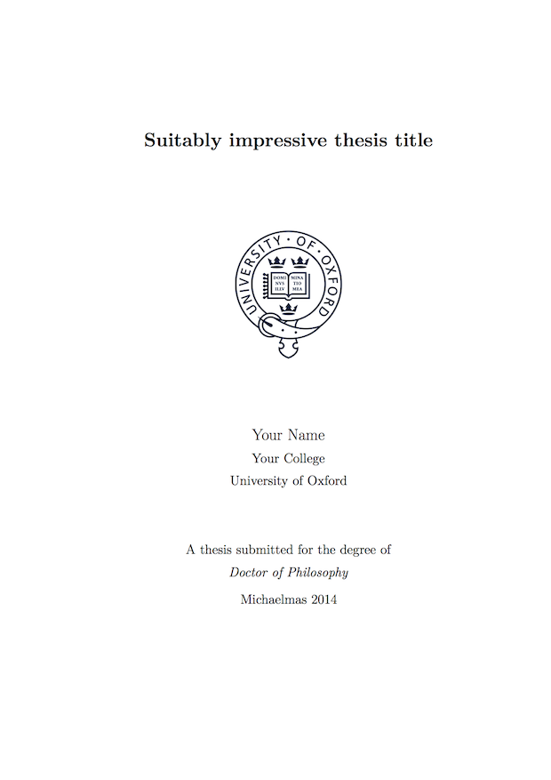
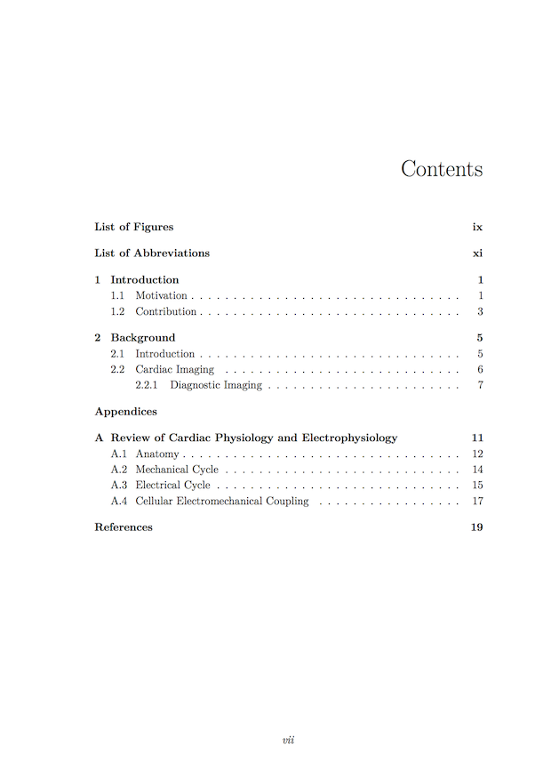
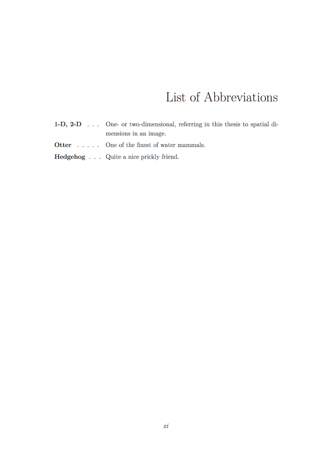
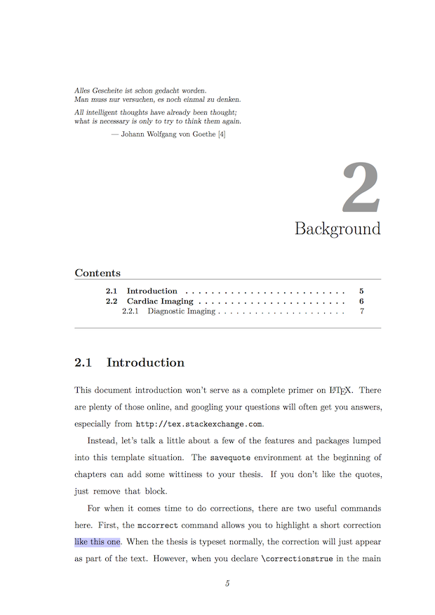
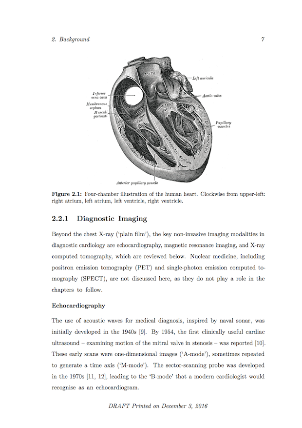

Oxford Thesis Template
======================

* Originally by Keith A. Gillow (gillow@maths.ox.ac.uk), 1997
* Modified by Sam Evans (sam@samuelevansresearch.org), 2007
* Modified by John McManigle (mcmanigle@gmail.com), 2015

Use this template to produce a standard thesis that meets the Oxford University
requirements for DPhil submission, and should be passable for other thesis-based
degrees (e.g. MPhil) as well.

In modern LaTeX implementations, you should be able to open Oxford_Thesis.tex with
your favorite editor and compile it.  By default, this template uses biber/BibLaTeX
for references / citations, so you may have to make the appropriate changes in
your build preferences.  A typical "full build" should be:

1. `pdflatex main.tex`
2. `biber main`
3. `pdflatex main.tex`
4. `pdflatex main.tex`

Alternatively, install [latexmk](https://www.ctan.org/pkg/latexmk/?lang=en) and
execute: `latexmk -pdf -synctex=1 main.tex`.

There should be subfolders called `text` and `figures`.  Keep all your work in these
folders.  This will make your life much simpler when you need to go about deleting
files creating while compiling while not deleting your actual thesis.

Make a new `.tex` file for each chapter and appendix, and place them in the `text`
folder.  If you'll have a figure-intensive thesis, subfolders in `figures` is a good
idea.  Use PDF graphics if at all possible.

The LaTeX cheat sheet is your friend.  Google it.  [StackExchange](http://tex.stackexchange.com) has
lots of answers to common LaTeX problems.

High-level details on what this template provides can be found [here](http://www.oxfordechoes.com/oxford-thesis-template/).

Example Screenshots
===================

