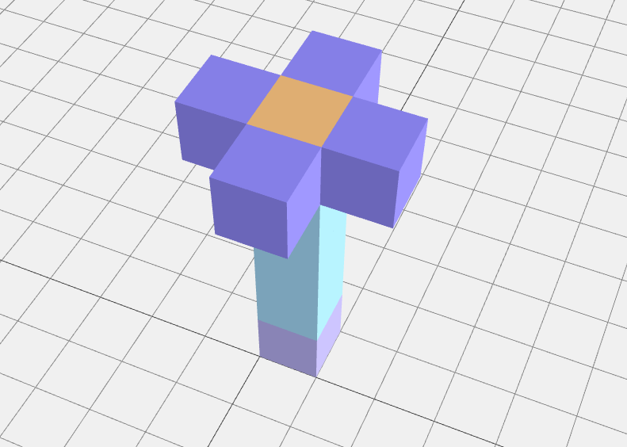
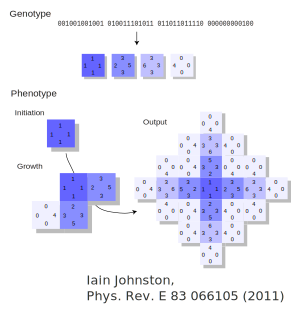
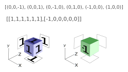

## Polycubes

#### Presented by Joakim Bohlin

</img>

---

## Self-assembled cubes
The original DNA robotics proposal

</img>

---

## Polyominoes
by Iain Johnston

</img>

-->

<!-- .slide: data-background-iframe="http://chaoticsymmetry.co.uk/polyominoes/index-old.php#" data-background-interactive -->

---

## Syntax for rules

<object data="../ruleOrder.svg" type="image/svg+xml" height="500"></object>

Notes: A winner-take-all (WTA) neural network with m memories that each
has n bits; x1 to xn and y1 to ym are binary inputs and outputs, respectively; 
wij (1 <= i <= n and 1 <= j <= m) are analogue weights of positive, real numbers; sj and sk (1 <= j != k <= m) are weighted sums of the inputs.

---

## Example

</img>

Notes: Example pattern recognition using target patterns as weights. Each 9-bit pattern is shown in a 3x3 grid. Each black or coloured pixel indicates a 1 and each white pixel indicates a 0. The two target patterns correspond to the letters 'L' and 'T', respectively. If the input pattern is corrupted (for example, the last bit of 'L' is flipped from 1 to 0, as indicated by the orange cross), then the neural network can still recognize it as being more similar to 'L' than to 'T', because the weighted sum using 'L' as weights is still larger than the weighted sum using 'T' as weights.

---

<!-- .slide: data-background-iframe="https://akodiat.github.io/polycubes/index.html" data-background-interactive -->

---

# Any questions?

---

</img>

This project has received funding from the European Union's Horizon 2020 research and innovation programme under the Marie Sklodowska-Curie grant agreement No 765703
